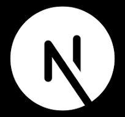

# Tahir Alauddin

<h3> Intro: </h3>

I’m a web developer passionate about impactful solutions, seeking a full-time role in a company that values innovation and growth.

Please visit my website: https://tahiralauddin.com

 
 

<h3 align="left">Connect with me:</h3>

   

 

<h3 align="left">Languages and Tools:</h3>

   
    
  
   

  
 
 

